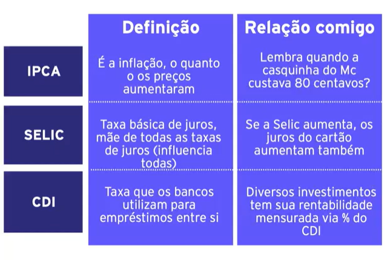

## Finanças Pessoais

### Receitas
 
### O que é receita?

soma de todos os valores que uma pessoa física ou juridica recebe dentro de determinado espaço de tempo, quanto a seus negócios, proventos ou rendas

simplificando: todo o dinheiro que você tem certeza que vai receber

- salario do mes (liquido)
- 13 salario
- dinheiro de investimentos (ex: aluguel de inquilino)
- renda extra
- vale refeiçao/alimentaçao (considera como receita mas tem destinaçao propria)
- plr/bonus (quando souber)

**na duvida chuta a receita para baixo**

###o que não é receita?

- bens em geral nao sao receita (carro, moto, casa, etc)

### Despesas 

### o que é despesa?

Tudo o que foi despendido, desembolsado, consumido

simplicando: é todo dinheiro que voce sabe ou imagina que vai tirar do bolso

- aluguel
- supermercado
- conta de luz, agua, gas, etc
- transporte
- restaurantes
- etc, etc, etc

**na duvida chuta os valores para cima**

### o que não é despesa

meio de pagamento em si (cartao de credito, carteira virtual, cheque, dinheiro)

a despesa é por exemplo supermercado o cartao de credito é a forma como voce usa para pagar

### Orçamento

receitas - despesas = orçamento

> dica de livro: a mente organizada

### porque categorizar o orçmento 

- categorização é natural do ser humano
- facilita assimilar informações
- evita uso desnecessario de energia
- pode ser feita de varias maneiras
- categoria "outros" é util

### Repense 

- preciso gastar com esse item?
- posso readecar minha rotina para nao gastar tanto?
- preciso gastar esse valor? posso pensar em uma alternativa ou renogociar? posso dividir essa despesa com alguem?

### como dividir seu orçamento

- 70% da renda atual para despesas atuais
  - 55% despesas essenciais (aluguel, energia, etc)
  - 5% educação
  - 10% gasto com o que eu quiser

- 30% da renda para o futuro
  - 20% metas a curto prazo
  - 10% metas longo prazo
 (3 anos ou mais)

 ### dividas

- identifique as dividas e as taxas que voce paga
    - verifique extrato e boletos de cobranças
- negocio as taxas de juros com o banco ou solicite a portabilidade
    - use ferramentas como o serasa para indentificar quais sao as taxas de juros praticadas pelos bancos, financeiras, cartoes de credito.
- alem disso, entenda seus direitos
    - pagamentos nao podem comprometer mais que 30% da sua renda, nao precisa contratar seguros para renegociar, qualquer coisa procuro o procon

### investimentos

### porque pessoas investem?

- aposentadoria
- montar casa propria
- viagem
- empreender

### juros compostos

- juros compostos em dividas sao super perigosos
- juros compostos em investimentos sao maravilhosos pois fazem o dinheiro trabalhar para você

é importante saber qual seu objetivo e quais riscos voce deseja correr

> um investimento é aquele que, apos analise, promete segurança e retorno adequado

### riscos

- baixo
    - tesouro direto
    - lci/cdbs/lca
    - fundos di taxa zero
    - poupança (ultimamente nao tem sido bem visto porque rende pouco e so em 30 dias)

- medio
    - açoes (blue chips)
    - fundos imobiliarios
    - fundos renda fica
    - fundos multimercados

- alto
    - açoes (small caps)
    - fundos de açoes
    - opçoes 
    - criptomoedas

### o que olhar ao escolher um investimento

- rentabilidade: IPCA, SELIC, CDI, Bovespa, etc
- Segurança
- liquidez
- custo de administraçao
- investimento minimo

> investimentos requerem estudo e analise, é preciso entender os riscos e sus objetivos pessoais para os investimentos

