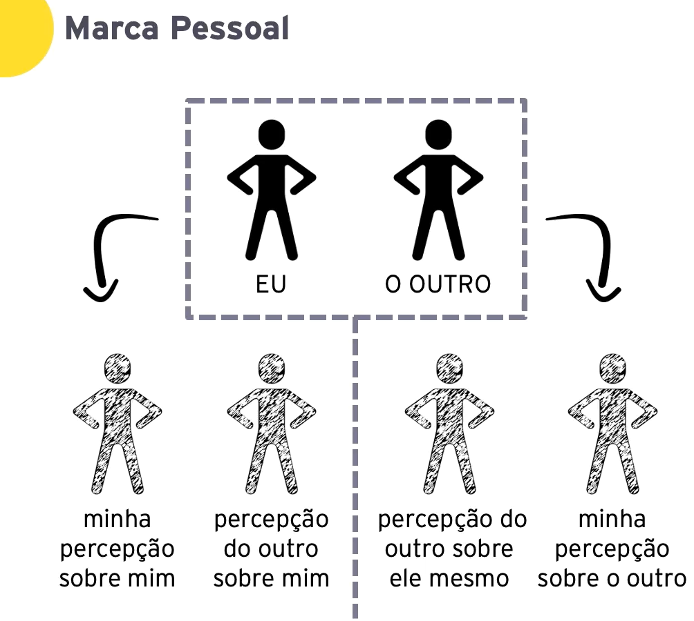
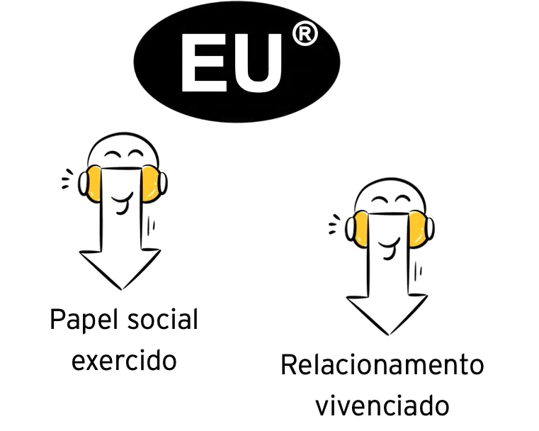
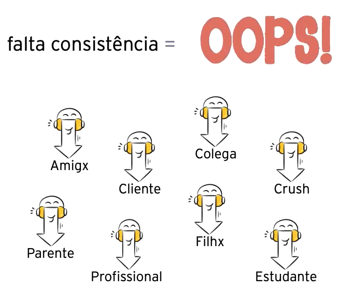

### Marca Pessoal

Cada pessoa ao longo do seu caminho constroi uma marca representada pelo seu nome

ela é a somatoria de diversas carcteristicas

- aparecnia
- personalidade
- valores
- interesses
- relacionamentos
- capacidades
- conhecimentos e etc

Essas caracteristicas sao demonstradas em tudo que a pessoa faz, toda e qualquer interação afeta a merca

Ela influencia a percepçao das pessoas em todos os relacionamentos, sejam curos ou longos, profundos ou rasos, pessoais ou profissionais

duas pessoas viram 6

tem o eu como eu sou  
o eu como eu me percebo  
o eu como o outro me percebe  
tem o outro como ele é  
o outro como ele se percebe  
e o outro como eu percebo ele  

> nós não nos relacionamos com pessoas e sim com a percepção que fazemos dela.

quando a percepção que as pessoas tem de alguém é parecida com o que ela é, ela tem uma boa marca pessoal

temos um agrupamento de variações da **marca-mãe**

existem deversas marcas derivadas da marca-mae o desafio é fazer todas coexistirem em harmonia, sem inconsistências

> em todas as variações da marca um grupo de caracteristicas fundamentais devem ser mantido, a falta de consistência é de grande prejuizo!

### questoes sobre marca pessoal

- marca fraca
    - quando voce conhece alguem mais nao tem nada a falar sobre ela, nao deixa nada consistente nos relacionamentos que tem
- marca concreta demais
    - quando tem algo que é marcante demais ex.: ela é muito cabeça dura, ela é muito sociável
- marca difusa
    - quando não tem linearidade, quando muda muito de uma papel pro outro
- marca duvidosa
    - quando a gente diz uma coisa e faz outra, causa uma impressão que não esta consistência com a nossa essencial, causa uma grande perca de credibilidade.

